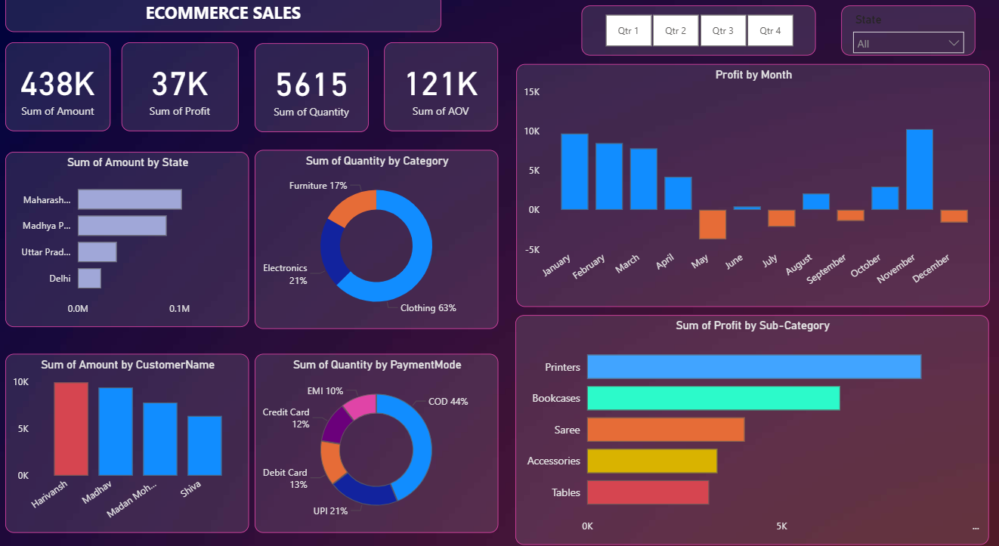

# 🛒 E-commerce Sales Dashboard

A dynamic, interactive Power BI dashboard designed to analyze sales performance across states, categories, and payment modes. It provides a clear view of profit trends, customer behavior, and category-wise distribution, helping businesses optimize sales and marketing strategies.

---

## 🎯 Purpose

The E-commerce Sales Dashboard enables business stakeholders to monitor sales and profit performance efficiently. It brings together multiple KPIs—such as total amount, profit, quantity, and average order value (AOV)—to provide actionable insights into product performance, customer segmentation, and payment behavior.

---

## 🧰 Tech Stack

The dashboard was built using the following tools and technologies:  
- **📊 Power BI Desktop** – Main data visualization platform used for report creation.  
- **📂 Power Query** – Data cleaning and transformation layer for preparing sales data.  
- **🧮 DAX (Data Analysis Expressions)** – Used for custom calculations such as Sum of Profit, AOV, and monthly aggregations.  
- **📈 Data Modeling** – Relationships established between sales, customer, and payment datasets for dynamic cross-filtering.  
- **📁 File Format** – `.pbix` for development and `.png` for dashboard preview.  

---

## 📊 Data Source

**Source:** Internal e-commerce transaction dataset.  

The dataset contains fields like `State`, `Category`, `Sub-category`, `Customer Name`, `Payment Mode`, `Month`, `Sales Amount`, and `Profit`.  
It enables state-level and category-level analysis, along with trend evaluation over time.

---

## 🌟 Features / Highlights

### **Business Problem**
E-commerce companies often struggle to understand key sales drivers across regions, customer types, and product categories. Without a unified dashboard, it becomes difficult to identify top-performing areas or detect profit fluctuations over time.

---

### **Goal of the Dashboard**
To create a **comprehensive, visual analytics tool** that helps business users:  
- Track sales and profit performance by month, region, and category.  
- Identify top customers and preferred payment modes.  
- Detect negative profit months and take corrective action.  
- Understand the contribution of each product category to total quantity and revenue.

---

### **Walkthrough of Key Visuals**

- **KPI Cards (Top Section)**  
  - **Sum of Amount:** 438K  
  - **Sum of Profit:** 37K  
  - **Sum of Quantity:** 5,615  
  - **Sum of AOV:** 121K  

- **Profit by Month (Top Right)**  
  - Shows monthly profit performance—highlighting positive peaks (January, February, December) and loss months (May, June, July).  

- **Sum of Amount by State (Bottom Left)**  
  - Maharashtra and Madhya Pradesh lead in total sales, followed by Uttar Pradesh and Delhi.  

- **Sum of Quantity by Category (Donut Chart)**  
  - Clothing dominates sales with **63%**, followed by Electronics (21%) and Furniture (17%).  

- **Sum of Amount by Customer Name**  
  - Displays top contributing customers, with *Hariyansh* and *Madhav* being the highest spenders.  

- **Sum of Quantity by Payment Mode**  
  - Cash on Delivery (COD) accounts for the majority of transactions (**44%**), followed by UPI (21%), Debit Card (13%), Credit Card (12%), and EMI (10%).  

- **Sum of Profit by Sub-Category (Bar Chart)**  
  - Printers and Bookcases yield the highest profits, while Tables and Accessories contribute moderately.  

---

### **Business Impact & Insights**
- **Regional Performance:** Maharashtra is the top-performing state in sales volume.  
- **Product Focus:** Clothing and Electronics categories drive the majority of sales.  
- **Profitability:** Despite high sales, profit fluctuates—suggesting potential pricing or cost management issues.  
- **Customer Analysis:** A few key customers generate significant revenue—highlighting opportunities for loyalty programs.  
- **Payment Preference:** COD remains dominant, but digital modes (UPI, Debit, Credit) show strong adoption trends.  

---

## 🖼️ Dashboard Preview

---
